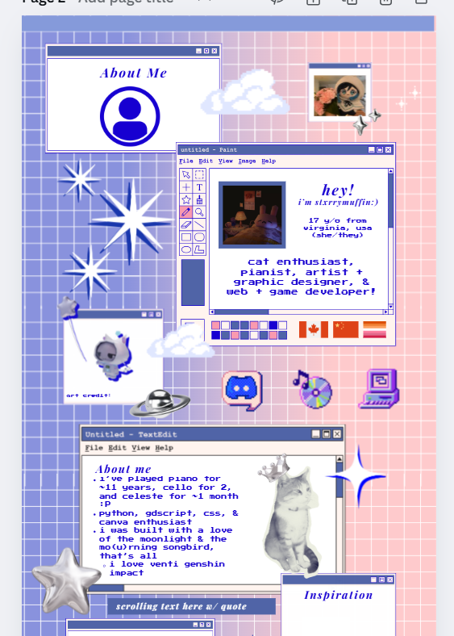
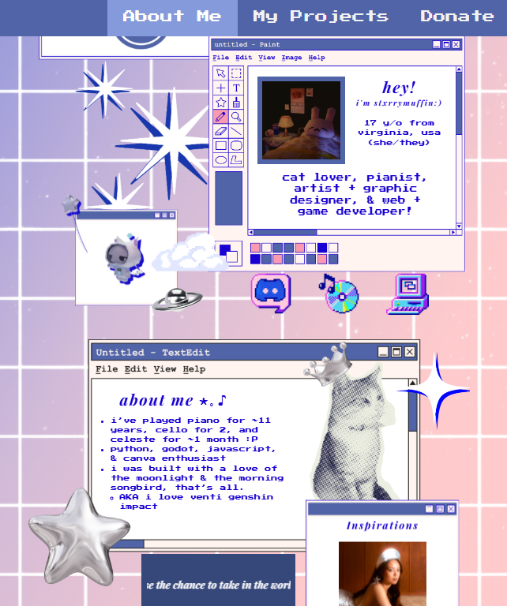

# stxrrymuffin's ✨*personal website*✨!

This project is a way to showcase some cool facts about me, some projects I've worked on 
in the past, people/games that inspire me, and some organizations I highly support (if you make a donation, let me know and I'll
match you!:D) For example, I love cats, Venti from Genshin Impact, and retro / low poly aesthetics :>

Link to website: [stxrrymuffin.github.io/personal-website](stxrrymuffin.github.io/personal-website)

*Note: you will probably have to switch between pages to enable the autoplay audio,
which is typically disabled on browsers.

## Why I made this project
I made this project because I want to be able to share a little bit about myself
through my art & creations, especially as I am getting to meet more people & different communities:)

I also wanted to make something personal for myself and I thought this website would be a good
creative outlet! I wanted to experiment with a lot of new things via this project, especially 3d & a BUNCH
of styling.

## How I made this project
I started off by wanting to make one of those 3d portfolio websites. I'm still planning on doing
that in the future, but for the purposes of Athena, I ended up cutting out that aspect
in favor of fleshing out the baseline CSS & HTML that I wanted.

I had four types of pages in mind initially: a "personal" 3d room, an about-me page, a
projects page, & a contact page. I focused a lot on the 3d aspect at first but when I started
working on the other pages, I realized I was really not content with how the pages looked. You can
check out some of my old commits to see screenshots of the time I spent on 3d modeling! (can I get just
one artifact for all the hours I spent in blender,, I'm so close to 40 artifacts,,,)

As a result, I took a lot of time in Canva to design something that I was happy with, and
from there on, it was mostly smooth sailing -- I just had to translate what I saw in Canva
to CSS/HTML! This was still pretty difficult because I wanted my page to be responsive to changes
in page width, but I think I got it working in the end!

I focused first on getting the major components of each page in (ie. the giant text boxes), and then
I moved onto adding the tiny accents into each page (the stars, balloons, ribbons, etc).

Canva -> website translation :D

(the cat meows, by the way! hover over it:P)

## Struggles & what I learned
Like I said earlier, I struggled a lot with designing the website. I had a lot of
references from Pinterest, but somehow they all combined into a terrible result
when I tried free-styling the design while programming simultaneously. I learned that
even just setting aside 1-2 hours doing planning (I spent 3+ :P) was essential to having a confident
vision in what I was going to create. This helped me find more motivation in completing
the website, too!

Something else I struggled with was deploying the website. It was my first time working
with Vite & three.js, and everything just fell apart when I deployed it to Vercel because
I had multiple html files. I ended up just cutting down my files significantly to the bare
minimum and deployed my project through GitHub instead -- though in the future, I'll definitely
be finding an alternative method when I re-incorporate 3d into my website.
